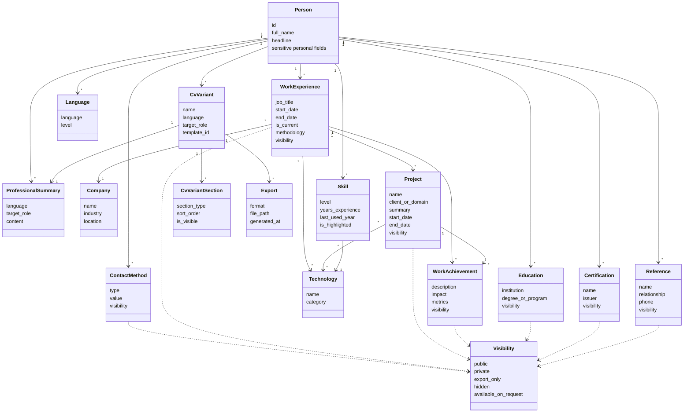

# Domain Definition

## Purpose

Define the core business model for the CV information system.

This document owns the domain language, entity boundaries, value objects, invariants, and rules that must remain true regardless of storage, API, or UI implementation.

## Technology Decision

The backend domain model will be implemented in Java.

Java records may be used for immutable data carriers where they fit well. Domain behavior and validation rules should remain independent from Spring MVC, persistence annotations, and controller DTOs unless a deliberate exception is documented.

## Initial Scope

- Person profile.
- Contact methods.
- Professional summaries.
- Education.
- Certifications.
- Companies.
- Work experience.
- Projects inside work experience.
- Work achievements.
- Technologies.
- Skills.
- Languages.
- References.
- CV variants.
- CV variant sections.
- Export history.

## Core Domain Rules

- A person is the root owner of CV data.
- Contact methods belong to one person and must have a type, value, and visibility.
- Work experience belongs to one person and references one company.
- Projects belong to one work experience and represent client projects, internal products, assignments, or major delivery streams performed during that job.
- Projects should not exist independently from work experience in the first domain model.
- A current work experience uses `is_current: true` and does not require an end date.
- A non-current work experience should have an end date.
- Work achievements may belong directly to a work experience or to a specific project inside that work experience.
- Technologies are normalized and reused by skills and work experience.
- Skills represent the current profile of a person and must reference a known technology.
- CV variants select language, target role, template, summary, section visibility, and ordering.
- Sensitive information is stored in the domain but hidden by default from public exports.

## Domain Object Map

This diagram shows the first domain model, including visibility points used by exports.

Visibility is evaluated during export. A CV variant decides which sections are visible, while each exportable item decides whether its own data can appear in that context.

## Record Creation Rule

When the Java implementation uses records or immutable data carriers for domain data, complex records should be created through the Builder pattern.

Use builders for records such as:

- `PersonRecord`
- `ContactMethodRecord`
- `WorkExperienceRecord`
- `ProjectRecord`
- `WorkAchievementRecord`
- `SkillRecord`
- `CvVariantRecord`
- `CvVariantSectionRecord`
- `ExportRecord`

Builder usage is required when a record has:

- More than three constructor arguments.
- Optional or nullable fields.
- Multiple fields with the same type, especially several `String` values.
- Collections such as contacts, projects, achievements, technologies, or sections.
- Default values such as visibility, sort order, or current-job flags.

Direct constructors are acceptable only for very small value records where argument order is obvious.

Builders should:

- Require mandatory fields before `build()`.
- Apply safe defaults.
- Validate simple invariants.
- Make defensive copies of collections.
- Keep records immutable after creation.

## Project Ownership Decision

Projects are part of work experience.

Reasoning:

- A project usually depends on the company, job title, dates, and role context of the work experience where it happened.
- CV variants can include or hide projects without creating a separate career timeline.
- Achievements and technologies can be attached to a project when they need more precision.
- The model remains simpler for the first implementation while still supporting detailed experience descriptions.

Initial project fields:

- `id`
- `work_experience_id`
- `name`
- `client_or_domain`
- `summary`
- `start_date`
- `end_date`
- `is_current`
- `role_context`
- `visibility`
- `sort_order`

## Open Questions

- Should achievements be shared across multiple CV variants through visibility tags?
- Should address/location be modeled as structured data or a contact method?

## Acceptance Criteria

- All domain entities from the main plan are represented.
- Each entity has clear ownership and lifecycle rules.
- Projects are modeled as children of work experience.
- Complex records are instantiated through builders instead of long positional constructors.
- Sensitive fields have explicit visibility behavior.
- Variant-specific selection does not delete historical data.
